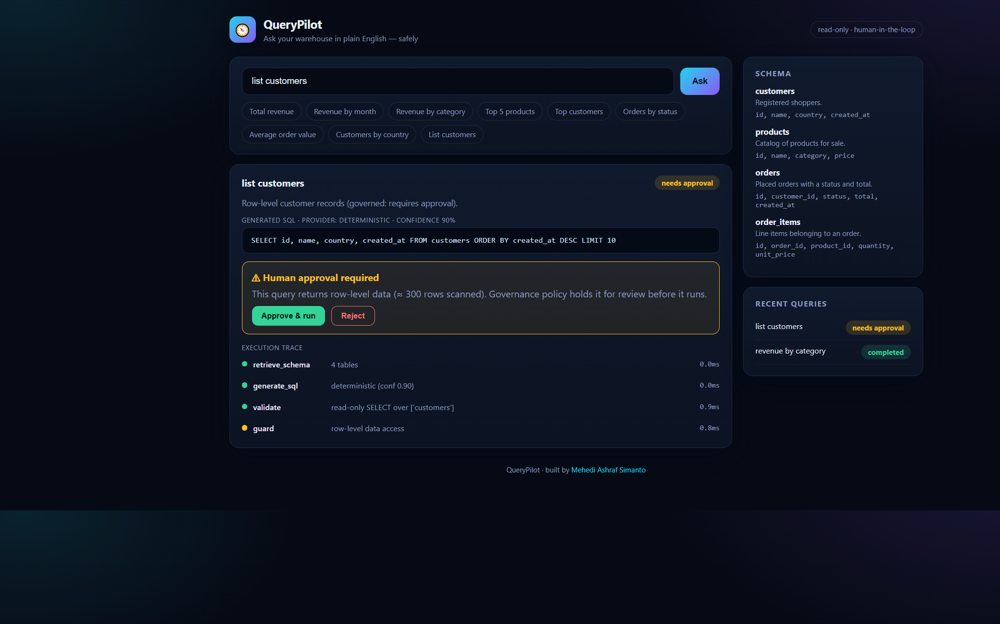
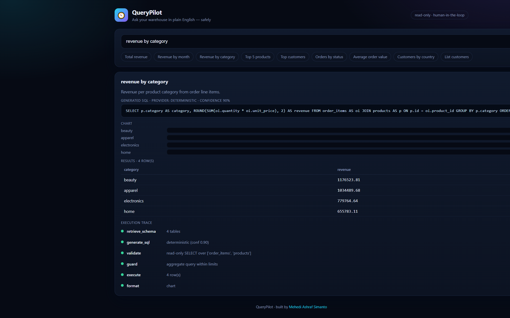
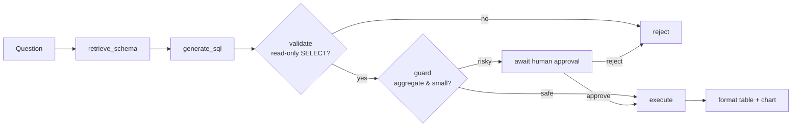

<div align="center">

# 🧭 QueryPilot

**Ask your data warehouse questions in plain English — safely.**

A natural-language-to-SQL analytics agent with a real safety boundary: every generated query is validated as a single read-only `SELECT`, guarded by a governance policy, and row-level access is held for human approval. Runs **fully offline** with a deterministic provider — no API key required.

[](https://github.com/simanto4321/querypilot/actions/workflows/ci.yml)


</div>



---

## Why this exists

Text-to-SQL demos are easy; **safe, governed** text-to-SQL is the hard part that
real teams need. QueryPilot focuses on the engineering that matters in production:

- **A hard safety boundary.** No matter what the NL layer produces, a query only
  runs if `sqlglot` confirms it is a *single, read-only `SELECT` over whitelisted
  tables*. Stacked statements, DML/DDL, `PRAGMA`, `ATTACH`, and unknown tables are
  rejected before touching the database.
- **Human-in-the-loop governance.** Aggregate/analytics queries auto-run;
  row-level data access (or large scans) is **held for explicit approval**.
- **Observability.** Every request produces a step-by-step trace
  (`retrieve_schema → generate_sql → validate → guard → execute → format`) with
  per-node status and timing.
- **No vendor lock-in to run it.** A deterministic, offline provider maps common
  analytics questions to grounded SQL, so the whole thing works with zero
  configuration. A hosted-LLM adapter (OpenAI) is a one-env-var switch.

## Demo

| Analytics query → chart + table + trace | Row-level access → human approval gate |
|---|---|
|  |  |

## The agent workflow



## Quick start

### Option A — one command (Docker)

```bash
docker compose up --build
# open http://localhost:8080  (Postgres warehouse + agent + web, auto-seeded)
```

### Option B — local dev (no Docker, no API key)

**Backend** (Python 3.12+):

```bash
cd backend
python -m venv .venv
# Windows: .venv\Scripts\activate  |  macOS/Linux: source .venv/bin/activate
pip install -r requirements.txt
python -m app.warehouse            # seed sample warehouse (SQLite)
uvicorn app.main:app --reload --port 8000
```

**Frontend** (Node 18+):

```bash
cd frontend
npm install
npm run dev                        # http://localhost:5173
```

Try: `total revenue`, `revenue by month`, `revenue by category`, `top 5 products`,
`orders by status`, `average order value`, `customers by country`, or
`list customers` (watch the approval gate trigger).

## Using a hosted LLM (optional)

```bash
export QUERYPILOT_LLM_PROVIDER=openai
export QUERYPILOT_OPENAI_API_KEY=sk-...
```

The LLM only *proposes* SQL — the validator and guard still enforce every safety
rule, so a jailbroken prompt cannot run a destructive query.

## Safety model

| Layer | Guarantee |
|-------|-----------|
| **Validator** (`validator.py`) | Parses with `sqlglot`; requires exactly one statement, a top-level `SELECT`, no write/DDL nodes anywhere in the AST, whitelisted tables only, and blocks `PRAGMA`/`ATTACH`/`OUTFILE`. |
| **Guard** (`agent.py`) | Estimates scan size; routes row-level or large queries to human approval. Auto-enforces a `LIMIT`. |
| **Execution** | Read-only connection; a read-only DB role is recommended in production. |

See [docs/ARCHITECTURE.md](docs/ARCHITECTURE.md) for the full design.

## API overview

| Method | Path | Description |
|--------|------|-------------|
| GET | `/api/health` | Liveness + active provider |
| GET | `/api/schema` | Semantic catalog |
| POST | `/api/ask` | Ask a question → SQL, guard decision, results, trace |
| POST | `/api/approve/{id}` | Approve a held query and run it |
| POST | `/api/reject/{id}` | Reject a held query |
| GET | `/api/history` | Recent queries |

## Testing

```bash
cd backend && pytest -q       # 27 tests: validator (injection/DML), agent flow, API
cd frontend && npm run build  # tsc type-check + production build
```

The validator suite includes prompt-injection-style payloads
(`SELECT * FROM orders; DROP TABLE customers; --`) to prove they are rejected.

## Project structure

```
querypilot/
├── backend/
│   ├── app/
│   │   ├── validator.py    # sqlglot AST safety boundary
│   │   ├── providers.py    # deterministic + OpenAI NL->SQL
│   │   ├── agent.py        # workflow graph, guard, approval, trace
│   │   ├── catalog.py      # semantic schema + synonyms
│   │   ├── warehouse.py    # read-only access + sample data
│   │   └── main.py         # REST API
│   └── tests/
├── frontend/               # React + TypeScript chat UI (Vite)
├── docs/                   # architecture + assets
└── docker-compose.yml
```

## Roadmap

- Multi-turn context (follow-up questions)
- Result caching + query cost history
- Column-level access policies and PII masking
- Richer chart selection (line/area for time series)

## Author

**Mehedi Ashraf Simanto** — [@simanto4321](https://github.com/simanto4321) · msimanto46@gmail.com

Licensed under the [MIT License](LICENSE).
