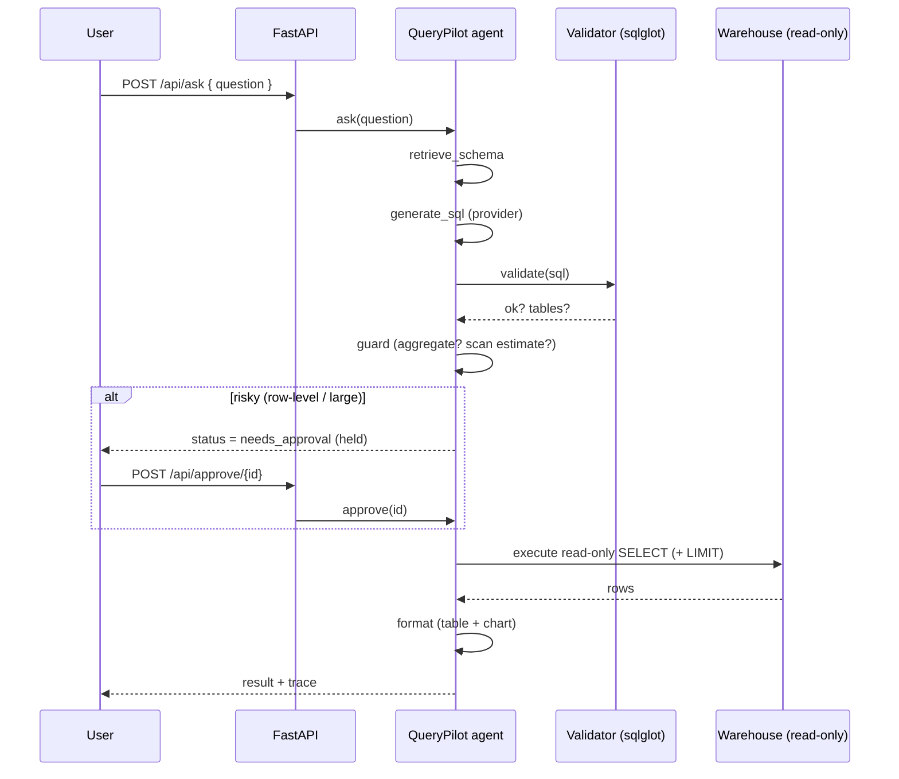

# Architecture

QueryPilot is a small, explicit agent: a pipeline of nodes with a recorded trace,
wrapped around a hard SQL safety boundary.

## Components

| Module | Responsibility |
|--------|----------------|
| `catalog.py` | Semantic schema: table/column descriptions + synonyms used for grounding and UI. |
| `providers.py` | NL→SQL. `DeterministicProvider` (offline intent matcher) and `OpenAIProvider` (hosted). |
| `validator.py` | The safety boundary. Parses SQL with `sqlglot` and rejects anything that is not a single read-only `SELECT` over whitelisted tables. |
| `agent.py` | The workflow graph, governance guard, approval lifecycle, and trace. |
| `warehouse.py` | Read-only warehouse access + a seeded sample e-commerce dataset. |
| `main.py` | FastAPI surface. |

## Request lifecycle

## Why a deterministic provider?

Shipping a text-to-SQL project that only works with a paid API key is a poor
portfolio artifact — reviewers can't run it. The deterministic provider maps a
curated set of analytics intents (revenue, top-N, breakdowns, counts, averages,
row-level lookups) to grounded, parameter-safe SQL. This makes the entire system:

- **runnable offline** and in CI with no secrets,
- **testable** end-to-end and deterministic,
- **honest** about the security model — because the safety boundary is exercised
  by real generated SQL, not mocked.

The `OpenAIProvider` demonstrates the same interface for a hosted LLM. Crucially,
the LLM output is untrusted and flows through the *identical* validator + guard.

## The safety boundary in detail

`validator.validate(sql)`:

1. Trim and reject empty input.
2. `sqlglot.parse` → must yield exactly **one** statement (blocks stacked injection).
3. Top-level node must be a `SELECT`/`UNION`/subquery-select.
4. Walk the entire AST — reject if any `Insert/Update/Delete/Drop/Create/Alter/Truncate/Merge/Command` node exists.
5. Block dangerous tokens (`pragma`, `attach`, `into outfile`, `load_file`, trailing `; --`).
6. Every referenced table must be in the catalog whitelist.

`validator.ensure_limit(sql, max_rows)` guarantees a bounded result set even for
approved row-level queries.

## Governance guard

The guard classifies each validated query:

- **aggregate** (contains `SUM/COUNT/AVG/MIN/MAX/GROUP BY`) and within scan
  limits → auto-run.
- **row-level** or **estimated scan > threshold** → `needs_approval`, held until a
  human calls `/api/approve/{id}` (or `/api/reject/{id}`).

This mirrors a realistic policy: aggregates are low-risk analytics; raw record
access is sensitive and should be reviewed.

## Limitations

- History and pending approvals are in-memory (single-process demo). A durable
  store (Redis/Postgres) is the natural next step.
- The deterministic provider covers common intents, not arbitrary questions; the
  LLM adapter is there for open-ended coverage.
